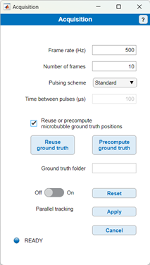

# Acquisition

Return to [README](../README.md#simulation-settings-panels)

Return to [root](..)

Finally, the "Acquisition panel" is where the imaging sequence is defined. The simulator embeds 3 traditional contrast pulsing schemes, namely pulse-inversion (**PI**), amplitude modulation (**AM**), and amplitude modulation pulse inversion (**AMPI**). Note that, to emulate practical implementation, **PI** uses 2 pulses, while AM and AMPI use 3 pulses; for AM and AMPI, the half amplitude pulse consists, in practice of 2 pulses where half the elements of the transducer are fired. Without nonlinearity and assuming a perfect driving, the linear superposition of the scatter generated by these 2 pulses is equal to that generated by the full pulse. The **time between pulses (μm)** is the time delay between the different pulses of the same pulsing scheme.

The button **Precompute ground truth** will generate a new folder in the `microbubble-flow-simulator-gui-main/ground_truth_frames` folder. This folder is given a default name corresponding to the time at which it is created. The simulator will then propagate the chosen number of bubbles in the vasculature and save the location of these microbubbles in space for each frame in a separate mat file in the newly created folder. We advise renaming this folder with a name reflecting the simulation being executed. This step is necessary prior to executing the simulation.

**Note**: If you run into the error “out of memory during deserialization”, deactivate the parallel streamline generation; this suggests that the underlying CFD model is too large for this type of parallelization.